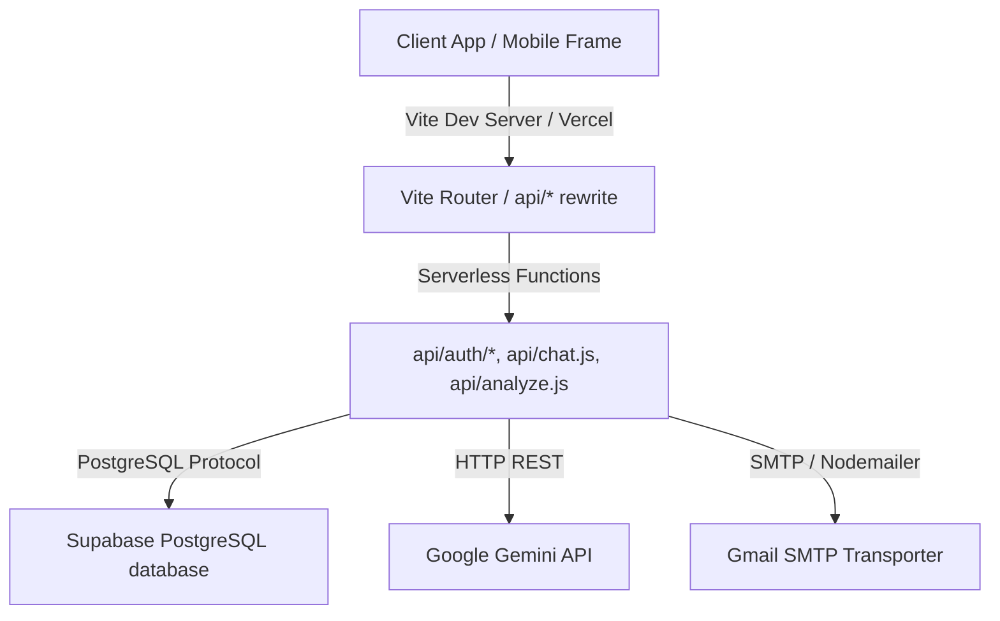

# Backend Stack Inventory - AAVIS Project

This document provides a comprehensive stack discovery of the AAVIS backend codebase for academic evaluation.

---

## 1. Technology Stack

- **Programming Language**: JavaScript / TypeScript (Node.js)
- **Framework**: Express (hosted in local development) & Vercel Serverless Functions (for API routing)
- **Runtime Environment**: Node.js v18+
- **Package Manager**: npm (configured via `package.json` and `package-lock.json`)

---

## 2. System Architecture

- **Pattern**: Layered API Architecture (Serverless Controllers & Client Context hooks).
- **Hosting Model**: Designed to be hosted serverless on Vercel with absolute static frontend hosting.

---

## 3. API Directory & Endpoints Structure

The backend exposes a hybrid API structure containing both public auth handlers and protected AI/Scanner endpoints:

### Endpoint Route Map
- **`/api/auth/register`**: Creates new users in Supabase Auth, triggers Nodemailer verification email.
- **`/api/auth/verifyLink`**: Validates the action token against Supabase with strict SSRF allowed hosts filters.
- **`/api/auth/forgot-password`**: Triggers password reset emails.
- **`/api/auth/reset-password`**: Completes user password resets.
- **`/api/analyze`**: Receives food labels, parses content using Gemini AI scanner engine.
- **`/api/chat`**: Handles interactive chat session operations.

---

## 4. Third-Party Integrations & Services

- **Database**: **Supabase** (PostgreSQL RLS protected).
- **AI Scanning**: **Google Gen AI SDK (Gemini)**.
- **Email Gateway**: **Nodemailer** using a Gmail app password SMTP link.
- **Client App Sync**: **Capacitor Mobile SDK** (Android plugins).
